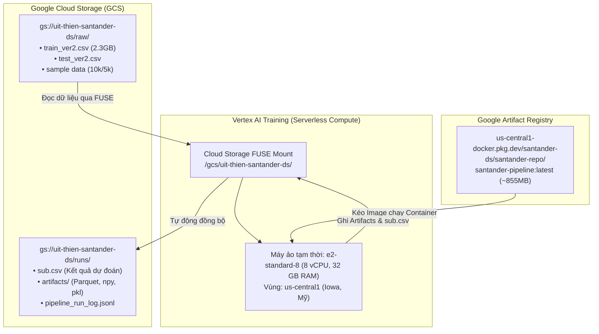

# Báo Cáo & Hướng Dẫn MLOps: Triển Khai Pipeline Santander Lên GCP

Tài liệu này ghi nhận toàn bộ kiến trúc, cấu hình hạ tầng, quy trình đóng gói container và kết quả thực nghiệm **MLOps** của dự án **Santander Product Recommendation** trên **Google Cloud Platform (GCP)**.

---

## Mục lục
1. [Tổng quan kiến trúc MLOps](#1-tổng-quan-kiến-trúc-mlops)
2. [Hạ tầng & Phân quyền GCP (Đã thiết lập)](#2-hạ-tầng--phân-quyền-gcp-đã-thiết-lập)
3. [Đóng gói Container & Cơ chế Docker Cache](#3-đóng-gói-container--cơ-chế-docker-cache)
4. [Các kịch bản thực thi trên Vertex AI (Custom Jobs)](#4-các-kịch-bản-thực-thi-trên-vertex-ai-custom-jobs)
5. [Kết quả thực nghiệm đã xác thực (Verified Proofs)](#5-kết-quả-thực-nghiệm-đã-xác-thực-verified-proofs)
6. [Quản lý dữ liệu & Kiểm soát chi phí](#6-quản-lý-dữ-liệu--kiểm-soát-chi-phí)
7. [Quy trình chỉnh sửa code & Cập nhật Image](#7-quy-trình-chỉnh-sửa-code--cập-nhật-image)
8. [Lộ trình duy trì & Mở rộng quy mô (Maintain & Scale-Up)](#8-lộ-trình-duy-trì--mở-rộng-quy-mô-maintain--scale-up)

---

## 1. Tổng quan kiến trúc MLOps

Hệ thống được thiết kế theo chuẩn **Serverless MLOps** trên GCP, tách biệt hoàn toàn giữa lưu trữ (Storage), đóng gói (Registry) và tính toán (Compute):



### Điểm nổi bật của kiến trúc:
- **Zero Idle Cost (Không phí duy trì máy ảo)**: Sử dụng Vertex AI Custom Training Job. Google chỉ bật máy khi có lệnh chạy, chạy xong tự động hủy máy 100%.
- **Cloud Storage FUSE**: Container đọc/ghi file như ổ đĩa local (`/gcs/...`) nhưng dữ liệu thực tế tự động lưu vào bucket GCS.
- **Pipeline Modular**: 5 stage độc lập (`ingest` -> `preprocess` -> `feature_engineering` -> `train` -> `predict`), trao đổi dữ liệu qua Parquet/Numpy, cho phép chạy trọn gói hoặc chạy chọn lọc từng stage.

---

## 2. Hạ tầng & Phân quyền GCP (Đã thiết lập)

Toàn bộ tài nguyên được đồng bộ tại vùng **`us-central1`** (Iowa, Mỹ) để khớp với vị trí Bucket GCS, tránh phí truyền dữ liệu cross-region.

### A. Thông số dự án
- **Project ID**: `santander-ds`
- **Project Number**: `180747094471`
- **Region**: `us-central1`
- **Bucket GCS**: `gs://uit-thien-santander-ds/`
- **Artifact Registry**: `us-central1-docker.pkg.dev/santander-ds/santander-repo/`

### B. Các API đã kích hoạt
1. `compute.googleapis.com` (Compute Engine API)
2. `aiplatform.googleapis.com` (Vertex AI API)
3. `artifactregistry.googleapis.com` (Artifact Registry API)
4. `cloudbuild.googleapis.com` (Cloud Build API)
5. `storage.googleapis.com` (Cloud Storage API)

### C. Phân quyền IAM (Service Account)
Compute Engine Default Service Account (`180747094471-compute@developer.gserviceaccount.com`) đã được cấp 3 quyền cốt lõi:
- `roles/storage.objectAdmin`: Đọc và ghi dữ liệu/artifacts trên Cloud Storage.
- `roles/artifactregistry.reader`: Kéo Docker image từ Artifact Registry về worker.
- `roles/aiplatform.user`: Khởi tạo và thực thi Vertex AI Custom Training Jobs.

*Lệnh kiểm tra lại phân quyền:*
```powershell
gcloud projects get-iam-policy santander-ds --flatten="bindings[].members" --format="table(bindings.role)" --filter="bindings.members:180747094471-compute@developer.gserviceaccount.com"
```

---

## 3. Đóng gói Container & Cơ chế Docker Cache

### A. Cấu trúc đóng gói
- **Base Image**: `python:3.11-slim`
- **Dependencies**: Bổ sung `xgboost>=2.0.0`, `lightgbm>=4.0.0`, `tqdm>=4.65.0`, `pyarrow>=17.0.0` vào `requirements.txt`.
- **`.dockerignore`**: Loại trừ thư mục `data/` (chứa `train_ver2.csv` nặng 2.3GB), `.venv/`, `.git/` để giảm thời gian nạp build context từ 3GB xuống còn **110 KB**.

### B. Dockerfile tối ưu
```dockerfile
FROM python:3.11-slim
WORKDIR /app

RUN apt-get update && apt-get install -y --no-install-recommends \
    build-essential \
    && rm -rf /var/lib/apt/lists/*

COPY requirements.txt .
RUN pip install --no-cache-dir -r requirements.txt

COPY pipeline/ ./pipeline/
COPY src/ ./src/

ENV PYTHONPATH=/app
CMD ["python", "pipeline/run_pipeline.py"]
```

> [!TIP]
> **Cơ chế Docker Layer Cache**: Vì bước `pip install` nằm TRƯỚC bước `COPY pipeline/`, khi bạn chỉ sửa code logic, Docker sẽ **tái sử dụng 100% cache thư viện**. Thời gian build lại image và push lên GCP chỉ mất **khoảng 15–30 giây** thay vì 50 phút.

---

## 4. Các kịch bản thực thi trên Vertex AI (Custom Jobs)

Chúng tôi đã thiết kế 3 file cấu hình YAML sẵn sàng chạy trên GCP:

### Kịch bản 1: Chạy thử nghiệm Sample 10.000 dòng (`custom_job_test.yaml`)
Dùng để kiểm thử kết nối cloud và logic pipeline nhanh trong ~1-2 phút:
```yaml
workerPoolSpecs:
  - machineSpec:
      machineType: e2-standard-8
    replicaCount: 1
    containerSpec:
      imageUri: us-central1-docker.pkg.dev/santander-ds/santander-repo/santander-pipeline:latest
      env:
        - name: SANTANDER_SAMPLE_ROWS
          value: "10000"
        - name: SANTANDER_INPUT_DIR
          value: "/gcs/uit-thien-santander-ds/raw"
        - name: SANTANDER_WORK_DIR
          value: "/gcs/uit-thien-santander-ds/test_run"
```
*Lệnh nộp job:*
```powershell
gcloud ai custom-jobs create --region=us-central1 --project=santander-ds --display-name="santander-test-run" --config=custom_job_test.yaml
```

---

### Kịch bản 2: Chạy FULL toàn bộ 13.6 triệu dòng (`custom_job_full.yaml`)
Huấn luyện mô hình trên toàn bộ tập dữ liệu gốc:
```yaml
workerPoolSpecs:
  - machineSpec:
      machineType: e2-standard-8
    replicaCount: 1
    containerSpec:
      imageUri: us-central1-docker.pkg.dev/santander-ds/santander-repo/santander-pipeline:latest
      env:
        - name: SANTANDER_INPUT_DIR
          value: "/gcs/uit-thien-santander-ds/raw"
        - name: SANTANDER_WORK_DIR
          value: "/gcs/uit-thien-santander-ds/full_run"
```
*Lệnh nộp job:*
```powershell
gcloud ai custom-jobs create --region=us-central1 --project=santander-ds --display-name="santander-full-run" --config=custom_job_full.yaml
```

---

### Kịch bản 3: Chạy chọn lọc từ Feature Engineering đến Train (`custom_job_fe_train.yaml`)
Bỏ qua bước `ingest` và `preprocess`, đọc trực tiếp Parquet sạch có sẵn trên GCS:
```yaml
workerPoolSpecs:
  - machineSpec:
      machineType: e2-standard-8
    replicaCount: 1
    containerSpec:
      imageUri: us-central1-docker.pkg.dev/santander-ds/santander-repo/santander-pipeline:latest
      command: ["bash", "-c"]
      args:
        - "python pipeline/feature_engineering.py && python pipeline/train.py"
      env:
        - name: SANTANDER_INPUT_DIR
          value: "/gcs/uit-thien-santander-ds/raw"
        - name: SANTANDER_WORK_DIR
          value: "/gcs/uit-thien-santander-ds/test_run"
```
*Lệnh nộp job:*
```powershell
gcloud ai custom-jobs create --region=us-central1 --project=santander-ds --display-name="santander-fe-and-train" --config=custom_job_fe_train.yaml
```

---

## 5. Kết quả thực nghiệm đã xác thực (Verified Proofs)

Hệ thống đã được kiểm thử và xác thực thành công ở cả 3 môi trường:

### A. Kiểm thử Local (Sample 10k dòng - Hoàn tất trong 5.1s)
- `ingest`: 1.1s (10.000 dòng train, 5.000 dòng test)
- `preprocess`: 1.5s (giảm RAM 44.5%)
- `feature_engineering`: 0.9s (tạo 5-month lag features, `X_train: (484, 154)`)
- `train`: 0.6s (`train_set_log_loss: 1.2804`)
- `predict`: 0.9s (xuất 5.000 dòng dự đoán `sub.csv`)

### B. Kiểm thử Container Docker Local
- Lệnh `docker run` chạy mượt mà trong môi trường Linux cô lập, hoàn tất 5 stage không phát sinh lỗi dependency hay path.

### C. Thực thi trên Cloud: Vertex AI Custom Job (`2966964378739408896`)
- **Trạng thái**: `JOB_STATE_SUCCEEDED` (Thành công 100%).
- **Thời gian tính toán thực tế**: ~30 giây compute.
- **Tự động dọn dẹp**: Vertex AI tự động teardown và hủy máy ảo ngay sau khi hoàn thành.
- **Dữ liệu ghi nhận trên GCS (`gs://uit-thien-santander-ds/test_run/`)**:
  - `sub.csv`: **640 KB** (Đã tải về máy local thành công: `sub_gcp_sample.csv`).
  - `artifacts/xgb_model.pkl`: **677 KB**
  - `artifacts/X_test.npy`: **6.1 MB**
  - `artifacts/pipeline_run_log.jsonl`: **5.8 KB**

### D. Thực thi Chọn lọc Stage trên Cloud (`1731676259072606208`)
- Bỏ qua hoàn toàn `ingest` và `preprocess`.
- `feature_engineering.py` đọc trực tiếp Parquet từ GCS, xử lý xong trong **3.4s**.
- `train.py` huấn luyện XGBoost và ghi đè `xgb_model.pkl` lên GCS trong **1.6s**.
- Hoàn tất thành công mà không cần chạy lại toàn bộ pipeline!

---

## 6. Quản lý dữ liệu & Kiểm soát chi phí

### A. Phân tầng dữ liệu trên Cloud Storage
1. **Tầng thô (`raw/`)**: `train_ver2.csv`, `test_ver2.csv` (Chỉ đọc, bất biến).
2. **Tầng thử nghiệm (`test_run/`)**: Chứa kết quả và artifacts của các lần chạy sample.
3. **Tầng chính thức (`full_run/` hoặc `runs/<version>/`)**: Chứa kết quả huấn luyện full tập dữ liệu.

### B. Các thao tác quản lý dữ liệu thường dùng
```powershell
# Xem danh sách file trên bucket
gcloud storage ls gs://uit-thien-santander-ds/test_run/

# Kiểm tra dung lượng bucket (kiểm soát chi phí)
gcloud storage du --readable-sizes gs://uit-thien-santander-ds/

# Tải file kết quả về máy local
gcloud storage cp gs://uit-thien-santander-ds/test_run/sub.csv ./submission.csv

# Xóa các file rác thử nghiệm cũ
gcloud storage rm -r gs://uit-thien-santander-ds/test_run/
```

### C. Kiểm tra trạng thái máy ảo (Đảm bảo không phát sinh chi phí)
```powershell
# Xác nhận không có VM nào chạy ngầm
gcloud compute instances list --project=santander-ds

# Xem danh sách các custom jobs đã hoàn thành
gcloud ai custom-jobs list --region=us-central1 --project=santander-ds
```

---

## 7. Quy trình chỉnh sửa code & Cập nhật Image

Khi bạn sửa đổi code trong thư mục `pipeline/`:

1. **Sửa code & test local nhanh**:
   ```powershell
   python pipeline/train.py
   ```
2. **Build & Push image mới lên GCP (Chỉ mất ~20-30s nhờ Cache)**:
   ```powershell
   docker build -t santander-pipeline:test .
   docker tag santander-pipeline:test us-central1-docker.pkg.dev/santander-ds/santander-repo/santander-pipeline:latest
   docker push us-central1-docker.pkg.dev/santander-ds/santander-repo/santander-pipeline:latest
   ```
3. **Nộp lại Job lên Vertex AI**:
   ```powershell
   gcloud ai custom-jobs create --region=us-central1 --project=santander-ds --display-name="santander-run-new" --config=custom_job_fe_train.yaml
   ```

---

## 8. Lộ trình duy trì & Mở rộng quy mô (Maintain & Scale-Up)

Dành cho giai đoạn nâng cao đồ án hoặc triển khai môi trường doanh nghiệp:

### A. Duy trì (Maintenance)
- **GCS Lifecycle Policy**: Thiết lập tự động xóa các file trung gian trong `artifacts/` sau 30 ngày để tiết kiệm chi phí lưu trữ.
- **CI/CD Automation**: Dùng GitHub Actions tự động build image và chạy unit test mỗi khi push code lên `main`.
- **Data Drift Detection**: Theo dõi sự thay đổi phân phối đặc trưng (PSI metric) giữa các tháng để phát hiện thời điểm model bị giảm độ chính xác.

### B. Mở rộng quy mô (Scaling Up)
- **Tăng tốc huấn luyện bằng GPU**: Thêm `device="cuda"` vào XGBoost/LightGBM và gắn thêm GPU NVIDIA T4 trong YAML để rút ngắn thời gian train từ 25 phút xuống 2 phút.
- **Tối ưu Lag Features bằng Polars / BigQuery**: Thay thế vòng lặp Python trong `feature_engineering.py` bằng Polars (đa luồng out-of-core) hoặc BigQuery SQL Window Functions (`LAG() OVER (...)`) để xử lý hàng trăm triệu giao dịch trong vài giây.
- **Real-Time Recommendation Serving**: Đóng gói `xgb_model.pkl` thành một API bằng **FastAPI** và deploy lên **Google Cloud Run** để trả kết quả gợi ý sản phẩm thời gian thực (<50ms) cho ứng dụng Mobile Banking.
- **Tự động hóa định kỳ**: Kết nối **Cloud Scheduler** với Vertex AI Pipelines để tự động kích hoạt huấn luyện lại mô hình vào ngày 28 hàng tháng sau khi ngân hàng chốt sao kê.

---

## 9. Đánh giá Model Local (Validation Offline) & Smoke Test

Điểm test chính thức chỉ có khi submit lên Kaggle (tháng 06/2016). Để lặp nhanh và đo lường độ chính xác ngay tại máy local hoặc trong Vertex AI mà không cần nộp bài, hệ thống đã tích hợp cơ chế **Offline Temporal Validation** và **Smoke Test**.

### A. Cơ chế Validation Offline (Stage `evaluate`)
1. **Thiết lập tập Valid**:
   - Lấy tháng **06/2015** (cùng mùa hè với tháng test 06/2016).
   - Tách 20% khách hàng làm tập validation (`X_val.npy`, `val_cust_ids.npy`), 80% còn lại dùng để huấn luyện (`X_train.npy`, `y_train.npy`).
   - Nhãn thực tế (Ground Truth) được lưu tại `val_ground_truth.json`: danh sách các sản phẩm thực tế khách đã mua mới tại tháng 06/2015.
2. **Quy tắc Masking sản phẩm đã sở hữu (Chuẩn Kaggle)**:
   - Tra cứu dữ liệu tháng liền trước (`config.MONTH_PREV_LABEL = "2015-05-28"`).
   - Nếu khách hàng đã sở hữu sản phẩm $A$ ở tháng 5, hệ thống sẽ loại trừ $A$ khỏi danh sách đề xuất (chỉ tính xác suất cho các sản phẩm khách chưa có).
3. **Chỉ số MAP@7**:
   - Dự đoán phân phối xác suất, xếp hạng và lấy top 7 sản phẩm có điểm cao nhất.
   - Tính **Mean Average Precision @ 7 (MAP@7)** đối chiếu với `val_ground_truth.json`.
4. **Ghi log truy vết Run (`pipeline_run_log.jsonl`)**:
   Mỗi lần chạy sẽ tự động append 1 dòng JSON chứa:
   ```json
   {
     "stage": "evaluate",
     "timestamp": "2026-09-21T08:02:33.899143+00:00",
     "duration_sec": 4.03,
     "status": "success",
     "run_id": "2026-09-21_150233",
     "image_tag": "92ea02e",
     "map7_valid": 0.83035,
     "kaggle_public": 0.0295,
     "cost_usd": 0.0,
     "n_val_customers": 78
   }
   ```
5. **Cập nhật điểm Kaggle sau khi nộp bài**:
   Sau khi nộp `sub.csv` lên Kaggle và nhận được điểm Public Leaderboard, bạn chỉ cần gõ lệnh sau để đồng bộ vào log mà không cần chạy lại pipeline:
   ```powershell
   python pipeline/evaluate.py --update-kaggle 0.0295 --run-id latest
   ```

### B. Smoke Test không cần nhãn (Mục 2.2)
Bộ kiểm tra chất lượng tự động dùng trước khi train hoặc trước khi build Docker Image trong CI/CD:
```powershell
python pipeline/smoke_test.py
```
Gồm 3 bài kiểm tra nghiêm ngặt:
1. **Test 1 — Preprocess Schema & Dtypes**: Kiểm tra đầy đủ 22 cột định danh & nhân khẩu học, kiểm tra toàn bộ 24 cột sản phẩm trong train, đảm bảo các cột khóa chính (`ncodpers`, `fecha_dato`) không có giá trị Null, các cột số (`age`, `renta`, `antiguedad`) đúng kiểu số.
2. **Test 2 — No NaN / Inf in Features**: Đảm bảo `X_train.npy` và `X_val.npy` là ma trận 2D và số lượng giá trị `NaN` hoặc `Inf` hoàn toàn bằng 0.
3. **Test 3 — Format Submission File (`sub.csv`)**: Kiểm tra header `ncodpers,added_products`, kiểm tra đủ 100% số lượng khách hàng test, không trùng lặp `ncodpers`, và mỗi khách hàng được đề xuất đúng 7 sản phẩm **không trùng lặp** bên trong.

### C. Lệnh chạy nhanh Validation & Smoke Test
```powershell
# 1. Chạy riêng stage evaluate khi đã có model
python pipeline/evaluate.py

# 2. Hoặc chạy qua pipeline với biến lọc stage
$env:SANTANDER_STAGES="evaluate"
python pipeline/run_pipeline.py

# 3. Chạy toàn bộ Smoke Test
python pipeline/smoke_test.py
```